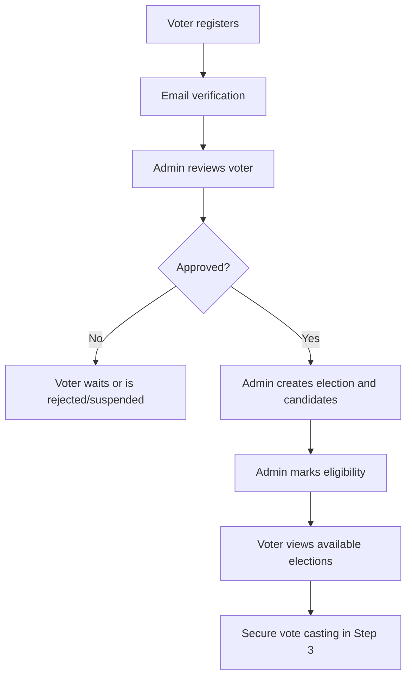

# Activity Diagram

```mermaid
flowchart TD
  A["Voter registers"] --> B["Email verification"]
  B --> C["Admin reviews voter"]
  C --> D{"Approved?"}
  D -- "No" --> E["Voter waits or is rejected/suspended"]
  D -- "Yes" --> F["Admin creates election and candidates"]
  F --> G["Admin marks eligibility"]
  G --> H["Voter views available elections"]
  H --> I["Secure vote casting in Step 3"]
```
