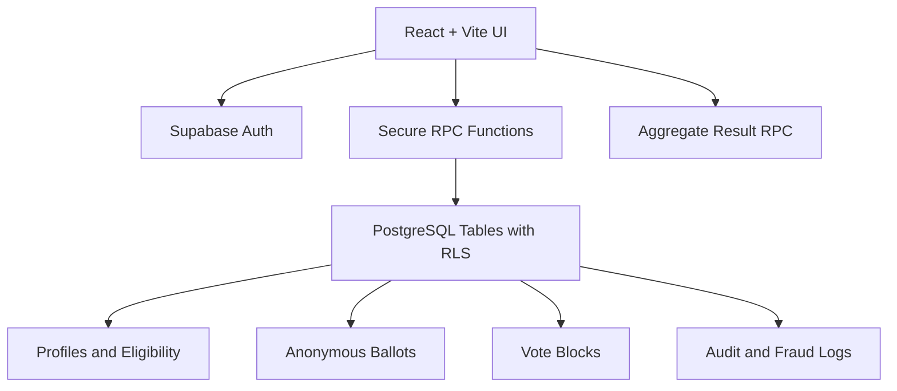

# Architecture Diagram

```mermaid
flowchart TD
  UI["React + Vite UI"] --> Auth["Supabase Auth"]
  UI --> RPC["Secure RPC Functions"]
  RPC --> DB["PostgreSQL Tables with RLS"]
  DB --> Profiles["Profiles and Eligibility"]
  DB --> Ballots["Anonymous Ballots"]
  DB --> Blocks["Vote Blocks"]
  DB --> Logs["Audit and Fraud Logs"]
  UI --> Results["Aggregate Result RPC"]
```
