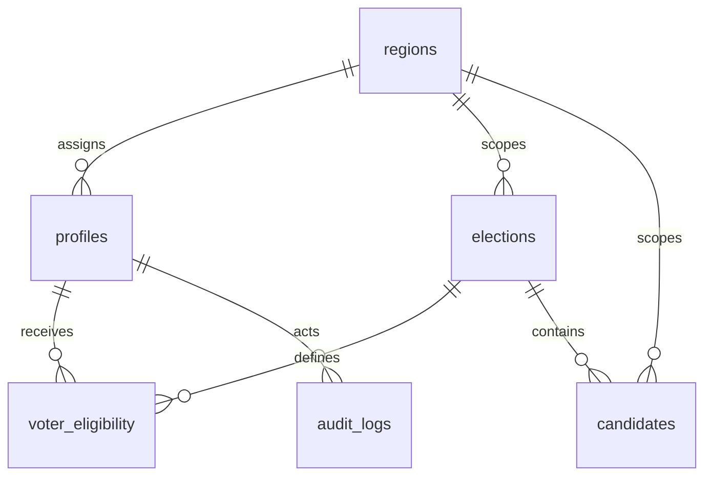

# ER Diagram

```mermaid
erDiagram
  regions ||--o{ profiles : assigns
  regions ||--o{ elections : scopes
  regions ||--o{ candidates : scopes
  profiles ||--o{ voter_eligibility : receives
  elections ||--o{ voter_eligibility : defines
  elections ||--o{ candidates : contains
  profiles ||--o{ audit_logs : acts
```
