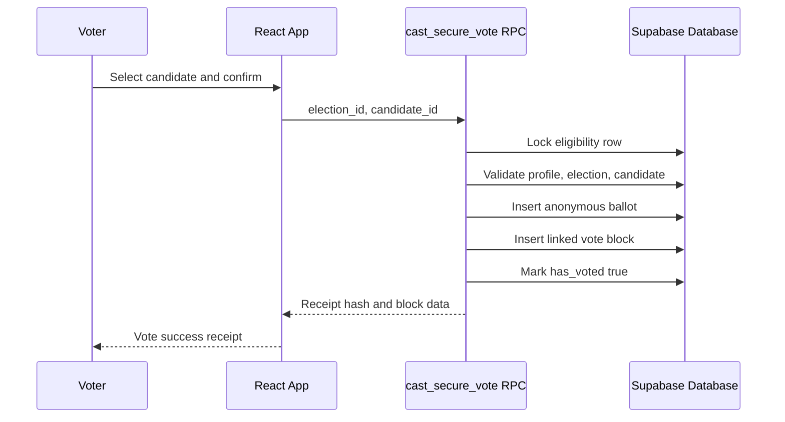

# Voting Sequence Diagram

```mermaid
sequenceDiagram
  participant V as Voter
  participant UI as React App
  participant RPC as cast_secure_vote RPC
  participant DB as Supabase Database
  V->>UI: Select candidate and confirm
  UI->>RPC: election_id, candidate_id
  RPC->>DB: Lock eligibility row
  RPC->>DB: Validate profile, election, candidate
  RPC->>DB: Insert anonymous ballot
  RPC->>DB: Insert linked vote block
  RPC->>DB: Mark has_voted true
  RPC-->>UI: Receipt hash and block data
  UI-->>V: Vote success receipt
```
