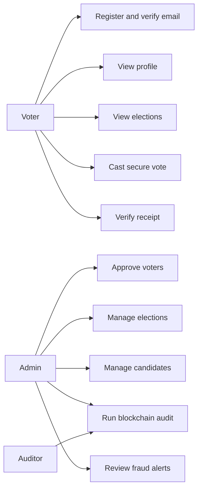

# Use-Case Diagram

```mermaid
flowchart LR
  V["Voter"] --> R["Register and verify email"]
  V --> P["View profile"]
  V --> E["View elections"]
  V --> C["Cast secure vote"]
  V --> VR["Verify receipt"]
  A["Admin"] --> AV["Approve voters"]
  A --> ME["Manage elections"]
  A --> MC["Manage candidates"]
  A --> AU["Run blockchain audit"]
  A --> FR["Review fraud alerts"]
  AD["Auditor"] --> AU
```
